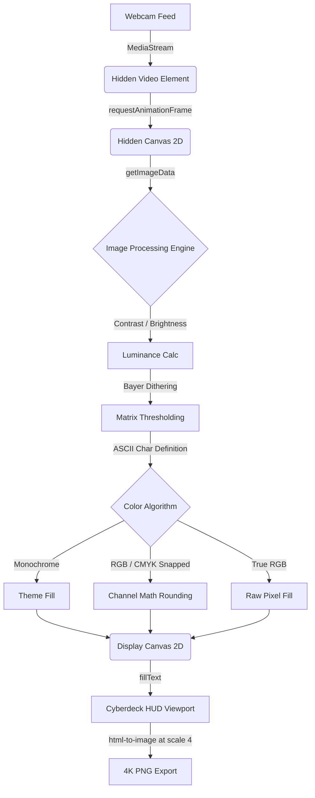

# ASCII.RAW // CAM_01

A high-performance, browser-based HTML5 Canvas ASCII camera featuring real-time image processing, mathematical RGB/CMYK pixel snapping, classic retro Bayer dithering, and 4K print-quality exports. Wrapped in an immersive, interactive cyberpunk HUD UI.

## Live Links
- **Vercel App:** [https://ascii-teal.vercel.app](https://ascii-teal.vercel.app)
- **Custom Domain:** [http://asciiraw.erebuzzz.tech](http://asciiraw.erebuzzz.tech)

## Architecture

The engine runs purely on the frontend using HTML5 Canvas APIs, maintaining a butter-smooth 15 FPS while processing thousands of raw pixels per frame without heavy WASM or WebGL dependencies.



## Features

- **Image Processing**: Real-time Brightness and Contrast controls applied instantly to raw video buffers.
- **Hardware Mods & Glitch**: Authentic 1-bit Bayer Dithering matrices, Sensor Mirroring, and Chromatic Aberration (RGB Split shadow filtering).
- **Color Rendering Algorithms**: 
  - *Monochrome*: Themed phosphor glow.
  - *True RGB*: 1:1 pixel color translation.
  - *RGB Snapped*: Hard rounding to retro primary colors.
  - *CMYK Snapped*: Mathematical channel dominance isolating Cyan, Magenta, Yellow, and White highlights.
- **Dynamic Typography**: Custom character set inputs, adjustable Kerning (Letter Spacing), and Leading (Line Height).
- **Terminal Themes**: Matrix Green, Amber CRT, Cyber Blue, and Ghost White.
- **Ultra-HD Snapshot**: High-fidelity 4K `.png` export capability bypassing screen-resolution limitations using `html-to-image`.

## Local Development

```bash
npm install
npm run dev
```

Open `http://localhost:3000` and click **Init Sensors**.  
*Note: Camera APIs require a secure origin in production (`https://` or `localhost`).*

## Production Build

```bash
npm run build
npm start
```

## Deployment

Deploy instantly to Vercel:

```bash
npm i -g vercel
vercel --prod
```

## Contact & Author

- **X (Twitter):** [@erebuzzz](https://x.com/erebuzzz)
- **Email:** [kshitiz23kumar@gmail.com](mailto:kshitiz23kumar@gmail.com)
